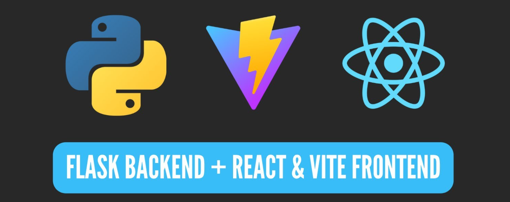
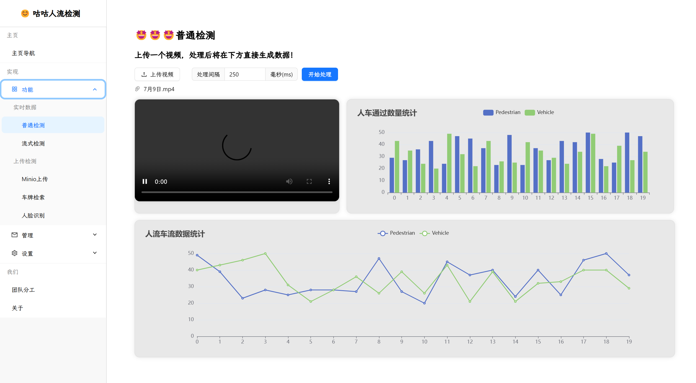
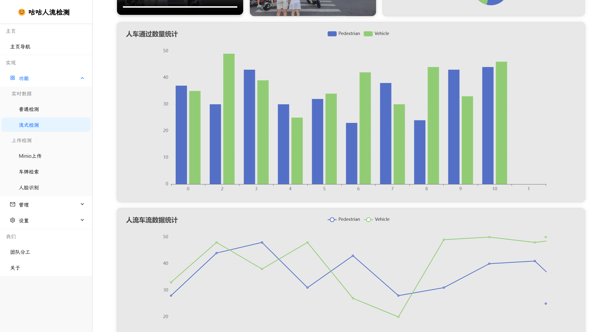

---

# 项目说明

## 项目概述

本项目为**武汉理工大学计算机学院东软实习项目**，时间范围为 **2024-07-01 至 2024-07-15**。项目旨在实现一个基于视频监控的人流和车流检测系统，采用前后端分离的架构，后端使用 Flask 框架，前端使用 React 和 Vite 进行开发。系统集成了视频处理、实时数据分析、和数据库管理等多种功能。

## 技术栈

- **前端**: 
  - **框架**: React
  - **构建工具**: Vite
  - **样式**: JSX

- **后端**:
  - **框架**: Flask
  - **数据库**: MySQL
  - **搜索引擎**: Elasticsearch (ES)
  - **存储**: 自建 MinIO

- **算法**:
  - **车牌识别**: YOLOv5
  - **人流和车流检测**: YOLOv5
  - **流量统计**: DeepSORT 模型

- **接口调试**: 使用 APIfox 进行规范化接口调试。

## 项目结构

```
project/
│
├── neusoft-backend/               # 后端代码目录
│   ├── main.py                     # 所有接口放在一起
│   ├── video.py                    # 视频处理接口
│   ├── video-m3u8.py              # M3U8 视频处理接口
│   ├── uploads/                    # 上传文件存储目录
│   ├── etc/                        # 其他辅助文件或无效文件的存放目录
│   └── readme.md                   # 后端说明文件
│
└── neusoft-vite/                  # 前端代码目录
    ├── src/                       # 前端源码
    ├── public/                    # 公共资源
    ├── package.json               # 前端依赖配置
    └── readme.md                  # 前端说明文件
```

## 使用说明

### 后端启动

在终端中运行以下命令以启动后端服务：

```bash
cd ./neusoft-backend 
python main.py
```

### 前端启动

在终端中运行以下命令以安装依赖并启动前端服务：

```bash
cd ./neusoft-vite
npm install 
npm run dev
```

## 接口规范与使用

具体的接口规范和说明文档已在以下文件中提供：

- **后端接口说明**: 请查看 [接口说明文档](./neusoft-backend/readme.md)
- **前端实现说明**: 请查看 [前端说明文档](./neusoft-vite/readme.md)

- **注意：该后端为模拟数据，仅用作API调试，具体实现请自行设计**

## 运行效果

该系统可以实现对视频中的人流和车流进行实时监测，并将结果展示在前端界面上。用户可以通过上传视频文件，获取统计数据和处理结果，包括：

- 人流量与车流量统计
  
- 视频处理结果
  
- 实时流媒体显示

## 结语

本项目展示了前后端分离的现代Web开发模式，结合了多种技术实现复杂的功能需求，提供了良好的用户体验和高效的数据处理能力。希望此项目能为后续的开发和学习提供有价值的参考。